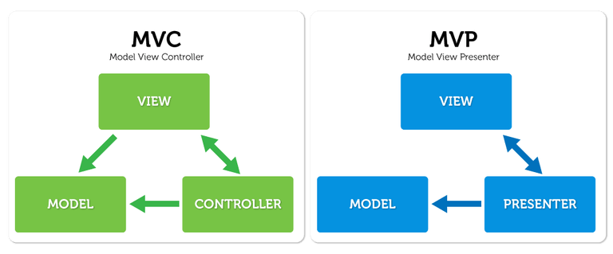

# MVP 패턴
```
MVC 패턴에서 파생된 아키텍처 패턴으로 Model, View, Presenter로 구성되어 있으며 MVC 패턴에서의 View의 Model에 대한 의존성을 없애서 모듈의 재활용 과 단위테스트가 용이하다는 장점이 있다.
```


- 모델(Model)
  - 앱에서 사용하는 데이터를 관리하며 비즈니스 로직이라 불리는 클래스의 집합이다.
- 뷰(View)
  - UI영역으로 데이터를 표시하는 역할만 담당한다. Presenter를 통해 유저 이벤트를 전달하고 결과를 받아 표시한다.
- 프레젠터(Presenter)
  - 뷰로 부터 전달받은 모든 유저 이벤트를 수집하고 모델에 데이터를 요청하고 그 결과를 View에 그대로 전달하는 역할을 한다.
<br><br>

### 아키텍처 패턴에 대한 다양한 해석
```
아키텍처 패턴은 항상 정확하게 정의하기가 어렵다.
 그 이유는 개념적으로 정리된 추상적인 패턴을 통해 여러 개발자가 이해한 내용을 바탕으로 구현하기 때문이며 이론적으로 분리한 각 부분들이 실무에서는 실제로 완벽하게 나누기 어려운 경우도 발생하기 때문이다. 

실제로 MVC 혹은 MVP 패턴을 설명하는 포스트와 강의들을 살펴보아도 Model을 비즈니스 로직 그 자체로 보는 시각과 그저 데이터만을 전달하는 매개체로 보는시각으로 나뉘기도 하며 MVP를 구현한 코드와 MVC를 구현한 코드가 차이가 없는 경우도 더러 있다. 
또, 같은 MVC 혹은 MVP 패턴을 그린 그림이라도 상단에 첨부한 이미지와는 다른 의존관계를 보여주는 그림들도 많아서 자칫 혼란만 가중될 수 있다.

정답을 찾기 보다는 어째서 이런 형태로 구분을하고 나누는 것인지 각 포스트마다 공통적으로 설명하는 장점과 아키텍처를 설계한 근본 이유를 이해하고 내가 이해한 내용에 맞추어 아키텍처 설계자가 의도한 장점을 최대한 취하도록 사용하는것이 중요하다고 생각한다.
```