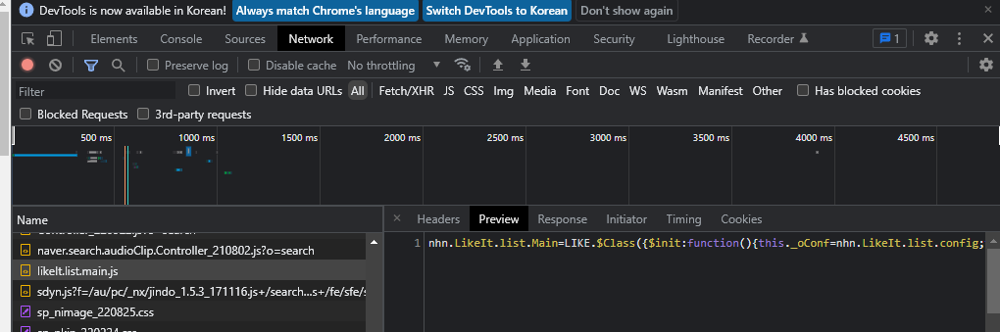
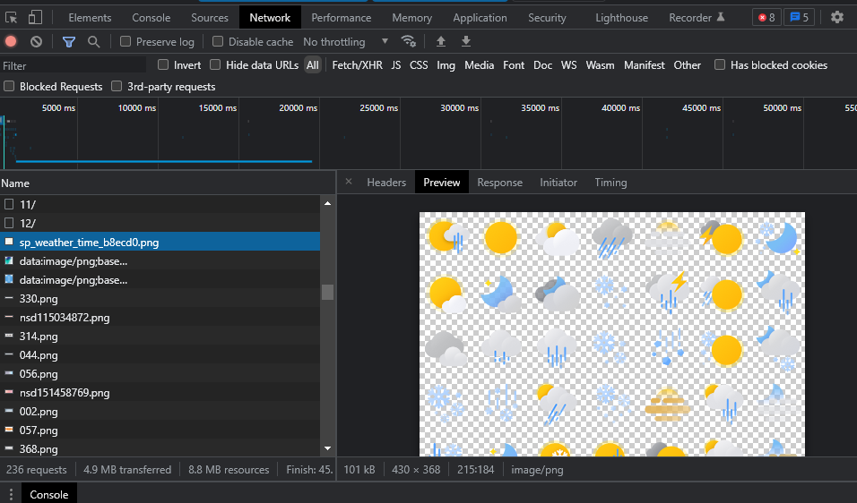
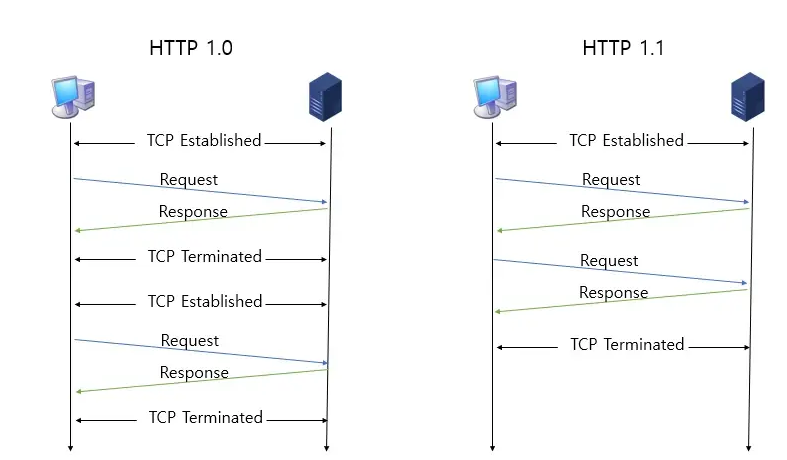
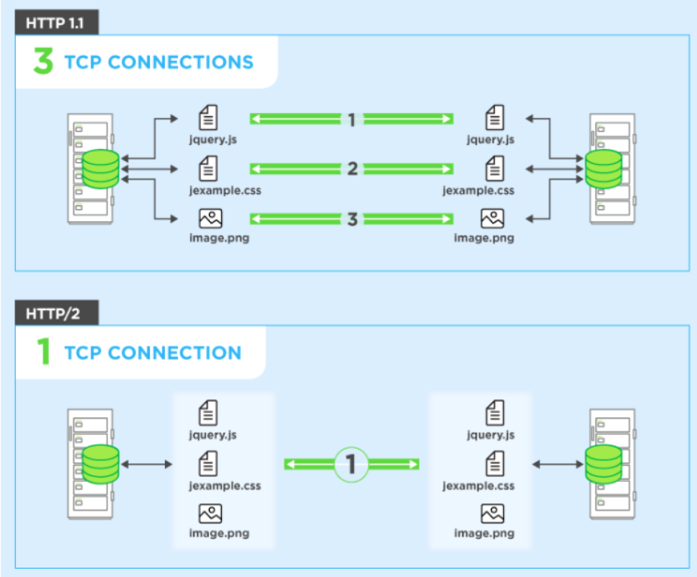
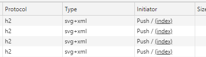

# HTTP 프로토콜

```
HyperText Transfer Protocol의 약자로 HyperText를 주고 받는 용도로 사용되는 애플리케이션 계층의 프로토콜이다.

주로 웹에서 사용되며 최근에는 서버끼리의 통신이나 각종 미디어를 요청하고 내려받는 경우에도 많이 사용되고 있다.

TCP 혹은 UDP 위에 만들어진 프로토콜이다.
```

- HTTP의 특징

  - Stateless : http 프로토콜은 서버에 상태를 유지하지 않는 무상태 프로토콜이다.
  - Connectionless : http 프로토콜은 연결을 지속적으로 유지하지 않는다.

<br>

## HTTP 1.0

```
HTTP 0.9에 없었던 HTTP메소드 및 헤더가 추가된 버전이다.
TCP기반이며 한번의 연결당 하나의 요청을 처리한다는 특징을 가지고 있다.
서버에 요청하고 응답을 받을때마다 TCP 연결이 필요하기 때문에 3way handshake가 필요하며 이로인해 패킷을 전달하고 응답을 받기까지 걸리는 시간인 RTT가 증가하는 단점이 있다.
```

- RTT 증가를 해결하기 위해 책에서는 이미지 스플리팅과 코드압축 방법을 소개하고 있다.

<br>

- 코드압축 예시 - 네이버 좋아요 js
  

<br>

- 이미지 스플리팅 예시 - 네이버 날씨
  

<br>

## HTTP 1.1

```
1997년 등장 후 현재에도 가장 많이 사용하는 버전으로 대부분의 기능정 정의가 이때 완성 되었다.

이후 등장한 http2 혹은 3 버전은 기능보다는 성능개선에 초점이 맞춰져 있기 때문에 1.1버전이 http 프로토콜을 설명할때에 가장 중요한 버전이라고 할 수 있다.

http 1.1버전은 1.0과 다르게 한번의 tcp연결을 통해 여러 요청을 처리할 수 있다. 하지만 순차적으로 요청이 처리되기 때문에 앞선 요청의 처리시간이 길다면 이어지는 요청들이 지연된다는 단점을 가지고 있다.

또, 책에서는 무겁고 압축되지 않은 헤더 역시 단점으로 뽑고있다.
```



<br>

## HTTP 2

```
2015년 http 1.1버전에서 성능이 개선된 버전으로 멀티플렉싱, 헤더압축, 서버푸시, 요청 우선순위 처리를 지원하는 버전이며 역시 TCP 기반으로 만들어졌다.
```

- 멀티플렉싱
  

  브라우저가 하나의 커넥션 상에서 여러개의 request를 보내는 기술을 말한다.

  보낼때에 순서와 상관 없이 받을때는 순서를 신경 쓰지 않는다.

  HTTP1.1에서는 한개의 커넥션으로 여러요청을 순서대로 처리하기 때문에 여러 요청을 동시에 하고자 한다면 여러개의 커넥션을 맺을 필요가 있었으나 HTTP2는 멀티플렉싱 기술을 통해 하나의 커넥션을 맺고 여러 요청을 동시에 처리하는게 가능해졌다.

  이때 하나의 커넥션 내에 각각의 요청은 별도에 스트림이라는 개념을 통해 송수신이 이루어지며 중간에 패킷손실이 발생되더라도 해당스트림만 영향을 받게 된다.

  스트림내에 요청은 여러 조각으로 나누어져서 전송되게되며 서버에서 다시 조립해서 하나의 요청으로 처리를 하게된다.

    <br>

- 헤더압축은 말그대로 HTTP 헤더를 압축하는 것으로, 문자열 압축 알고리즘으로 유명한 허프만 코딩 압축 알고리즘을 사용한다.

<br>

- 서버 푸시  
  

  HTTP2는 웹페이지 접속시 html뿐만 아니라 요청하기전에 미리 리소스(이미지, 폰트, js, css등)를 함께 보내줄 수 있다.

  엔진엑스 사용시 https://www.nginx.com/blog/nginx-1-13-9-http2-server-push/ 페이지를 참고해서 설정이 가능하다.

  <br>

- 스프링부트 HTTP2.0 설정

  HTTP2.0은 SSL/TLS 설정이 필수적이며 스프링부트를 사용할 경우에는 SSL/TLS 설정 후 HTTP2.0 프로토콜 사용 설정을 추가하는것으로 간단하게 사용할 수 있다.

  자세한 내용은 https://javaboja.tistory.com/26 블로그에 잘 설명되어 있다.

<br>

## HTTP 3

```
TCP 대신에 구글이 개발한 QUIC이라는 UDP기반의 전달계층 프로토콜을 기반으로 구현 함으로써 3way handshake 과정을 생략했으며 속도가 개선된 버전이다.

물론 HTTP2도 3way handshake를 줄이고자 2way handshake를 도입하기도 하였으나 HTTP3은 커넥션을 맺는 다는 행위 자체가 UDP위에 가볍게 구현되었기 때문에 커넥션을 맺는데 1RTT만이 소모된다.

또 HTTP2의 멀티플렉싱 역시 구현하고 있어서 요청의 병렬처리 또한 뛰어나다.

아직까지는 사용처가 구글서비스에 한정되어 있고 많은 서비스들이 HTTP1.1과 HTTP2를 많이 사용하고 있다.
```

- QUIC

  Quick UDP Internet Connections의 약자로 구글에서 개발한 프로토콜이다.

  TCP기반의 HTTP 성능을 개선하고자 UDP를 채택하였으며 전달속도 개선과 더불어 클라이언트와 서버의 연결수를 최소화 하고 대역폭을 예상하여 패킷 혼잡을 피하는것이 주요 특징으로 꼽힌다.

<br><br><br>

※ http의 각 헤더와 메서드, 상태코드 등에서도 정리하면 좋겠지만 양이 너무 방대하기 때문에 내용이 궁금하다면 중요한 부분만 짧게 잘 정리한 인프런 김영한 강사님의 http강의를 추천합니다.
